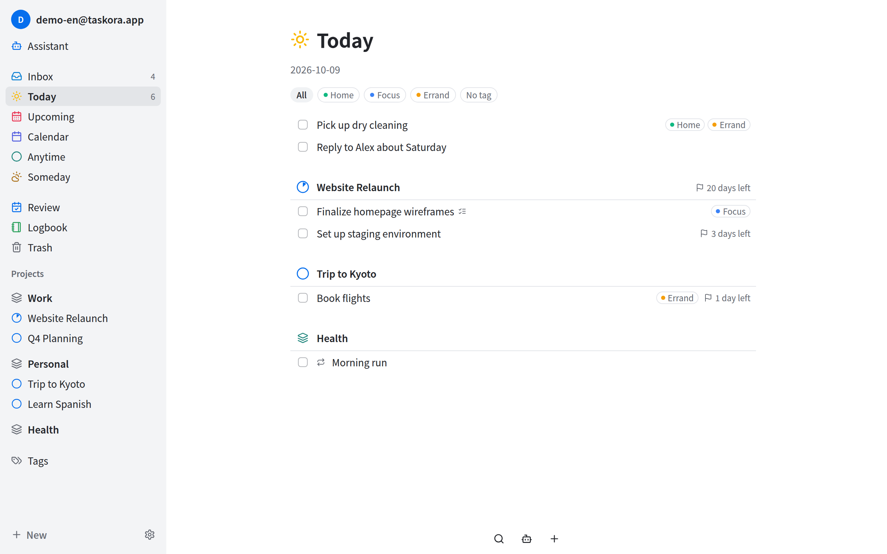
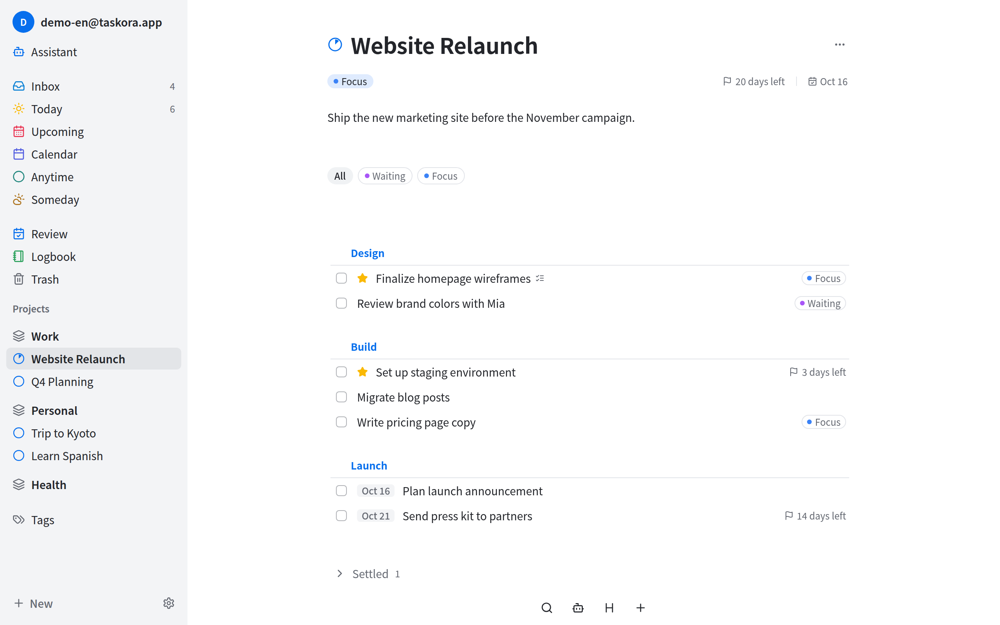
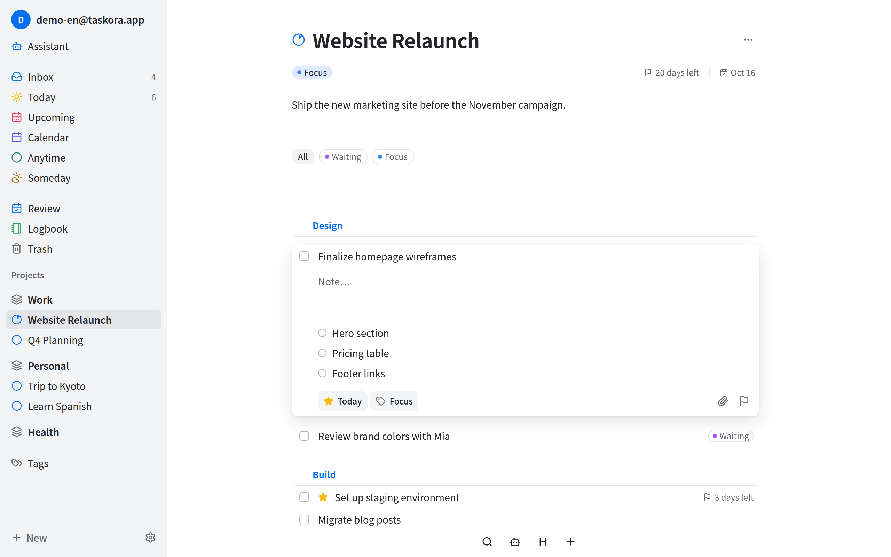
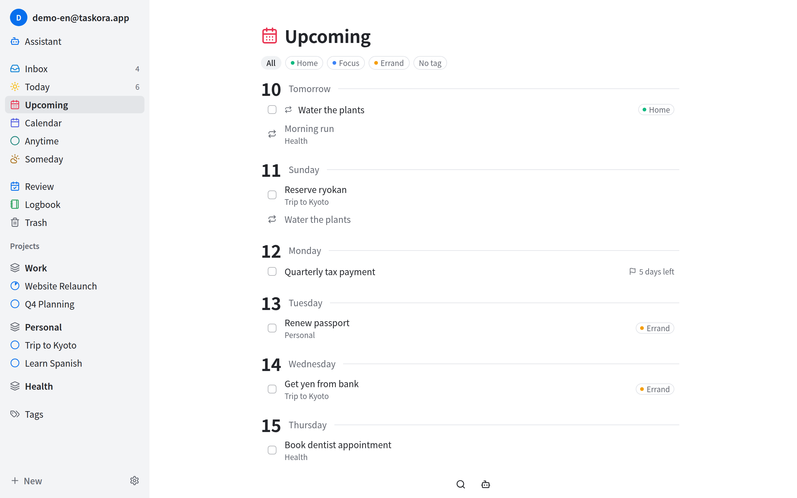
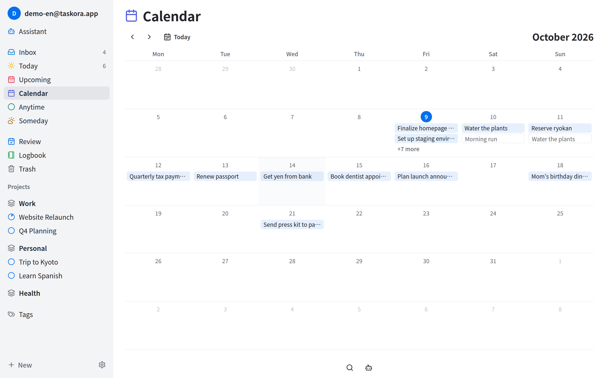
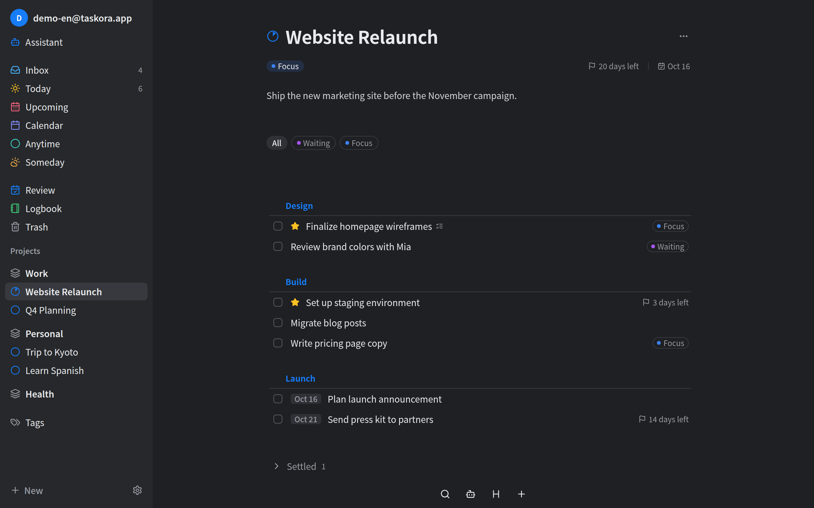

<div align="center">


# Taskora

**A calm, keyboard-first task manager you host yourself.**

Inspired by Things 3. Runs in the browser, on macOS, Windows, Linux and Android, and keeps all of them in sync through your own server.

[Download](https://github.com/MaplumeX/Taskora/releases/latest) · [Self-host](#self-host-the-server) · [Keyboard shortcuts](docs/keyboard-shortcuts.md) · [中文](README.zh-CN.md)

</div>



## Why Taskora

- **Plan your day, not your backlog.** Today shows only what you chose to work on, grouped by project and area. Everything else waits quietly in Anytime, Upcoming or Someday until it's time.
- **Works offline.** Every device keeps a full local copy of your tasks. Add, edit and complete things without a connection; changes sync the moment you're back online.
- **Your data, your server.** One `docker compose up` gives you a private sync server. No third-party cloud, no account with anyone but yourself.
- **Built for the keyboard.** Navigate, create, complete, tag and reschedule without touching the mouse. Every shortcut can be rebound.

## Screenshots

<table>
  <tr>
    <td width="50%"><br /><sub><b>Projects</b>: group tasks under headings, track deadlines</sub></td>
    <td width="50%"><br /><sub><b>Tasks</b>: notes, checklists, tags, dates and attachments in place</sub></td>
  </tr>
  <tr>
    <td width="50%"><br /><sub><b>Upcoming</b>: what's coming, day by day</sub></td>
    <td width="50%"><br /><sub><b>Calendar</b>: the month at a glance</sub></td>
  </tr>
  <tr>
    <td colspan="2"><br /><sub><b>Dark mode</b>: follows your system, or pick one yourself</sub></td>
  </tr>
</table>

## Features

### Organize

- **Areas, projects and tasks.** Areas hold the big parts of your life (Work, Personal, Health); projects are finite goals inside them; tasks are the steps.
- **Headings** split a long project into phases.
- **Checklists** break a task into small steps without turning it into a project.
- **Tags** with colors and nesting. Filtering by a tag also matches its sub-tags, and tasks inherit tags from their project and area.
- **Attachments**: drop files onto a task. Images open in a built-in preview.
- **Duplicate** (⌘D) any task or project to reuse it as a template.

### Plan

- **Inbox** catches everything you haven't sorted yet.
- **Today**, **Upcoming**, **Anytime** and **Someday** show your tasks by when you plan to do them. Tasks scheduled for a day that has already passed stay in Today; they never pile up as "overdue".
- **Deadlines** are separate from planned dates, with a countdown that turns red when time is up.
- **Calendar** shows the whole month.
- **Repeating tasks and projects**: daily, weekly on chosen weekdays, monthly or yearly. Repeat from the planned date or from when you finished it. Skip a single occurrence when needed.
- **Reminders** pop up as system notifications on desktop and Android, with Complete and Snooze right in the notification.
- **Review** walks you through your projects and areas one by one, on a schedule you set for each, so nothing goes stale.
- **Logbook** keeps everything you've completed. **Trash** keeps what you deleted until you empty it.

### Work faster

- **Quick Add** from anywhere on your desktop with ⌘⇧Space / Ctrl+Shift+Space, even when Taskora is in the tray.
- **Multi-select and drag & drop**: move many tasks at once into a project, a heading, or onto a date in Upcoming.
- **Search** across areas, projects and tasks, narrowed down by tags.
- **Assistant** (optional): chat with an AI to create, reorganize and look up tasks. Bring your own key for any OpenAI-compatible endpoint; it's stored encrypted on your server.
- **English and Simplified Chinese** interface.

## Get the apps

Download the latest version from [**GitHub Releases**](https://github.com/MaplumeX/Taskora/releases/latest).

| Platform | File |
|---|---|
| macOS (Apple Silicon) | `Taskora_x.y.z_aarch64.dmg` |
| Windows (x64) | `Taskora_x.y.z_x64-setup.exe` |
| Linux (x64) | `Taskora_x.y.z_amd64.AppImage` |
| Android (arm64) | `Taskora-vx.y.z.apk` |
| Web | Included with your server, open it in any modern browser |

On first launch, the desktop and Android apps ask for your **server address**: the URL of your Taskora server followed by `/api/v1`, e.g. `https://tasks.example.com/api/v1`.

> [!NOTE]
> The apps are not code-signed yet, so your system will warn you the first time:
>
> - **macOS**: right-click Taskora in Applications → **Open** → **Open**. If macOS says the app is damaged, run `xattr -dr com.apple.quarantine /Applications/Taskora.app`.
> - **Windows**: on the SmartScreen dialog, click **More info** → **Run anyway**.
> - **Linux**: `chmod +x Taskora_*.AppImage`, then run it.
> - **Android**: allow your browser or file manager to install unknown apps.
>
> There is no auto-update yet. To upgrade, download the new version and install it over the old one; your data stays.

## Self-host the server

The server stores your data, syncs your devices and serves the web app. You need a machine with Docker.

**1. Get the config files**

```bash
mkdir taskora && cd taskora
curl -O https://raw.githubusercontent.com/MaplumeX/Taskora/main/docker-compose.yml
curl -o .env https://raw.githubusercontent.com/MaplumeX/Taskora/main/.env.example
```

**2. Edit `.env`.** At minimum, set your own values for:

| Variable | What it is |
|---|---|
| `POSTGRES_PASSWORD` | Database password |
| `JWT_SECRET` | Signs login sessions; use a long random string |
| `AGENT_ENCRYPTION_KEY` | Encrypts Assistant API keys; generate with `openssl rand -hex 32` |
| `NODE_ENV` | Set to `production` |

**3. Start it**

```bash
docker compose up -d
```

Open <http://localhost:7646> and create your account. For the desktop and Android apps, use `http://<your-server>:7646/api/v1` as the server address.

The ports are bound to `127.0.0.1` by default. To use Taskora from other devices, put it behind a reverse proxy with HTTPS (Caddy, nginx, Traefik…) pointing at port `7646`.

**Upgrading**

```bash
docker compose pull && docker compose up -d
```

To stay on a specific version, set `IMAGE_TAG=v0.8.0` (for example) in `.env`.

**Backups**

Your data lives in two Docker volumes: `pgdata` (the database) and `blobs` (attachment files). Back up both together.

## FAQ

**Can I use it without a server?**
No. The apps work offline, but they need a server to sign in and to sync between devices.

**Is there an iPhone app?**
Not yet. On iOS, use the web app in Safari.

**Is the Assistant required?**
No. It stays out of the way until you add an API key in Settings → Assistant.

## Development

Taskora is a pnpm monorepo (React + Vite, NestJS + PostgreSQL, Tauri 2). Domain terms are defined in [`CONTEXT.md`](CONTEXT.md), design decisions in [`docs/adr/`](docs/adr/), and release notes in [`CHANGELOG.md`](CHANGELOG.md).
