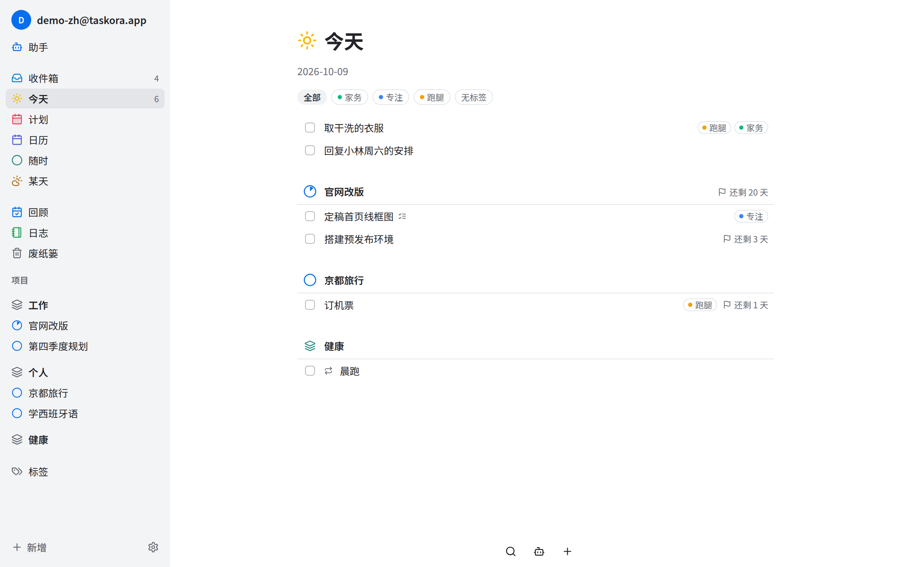
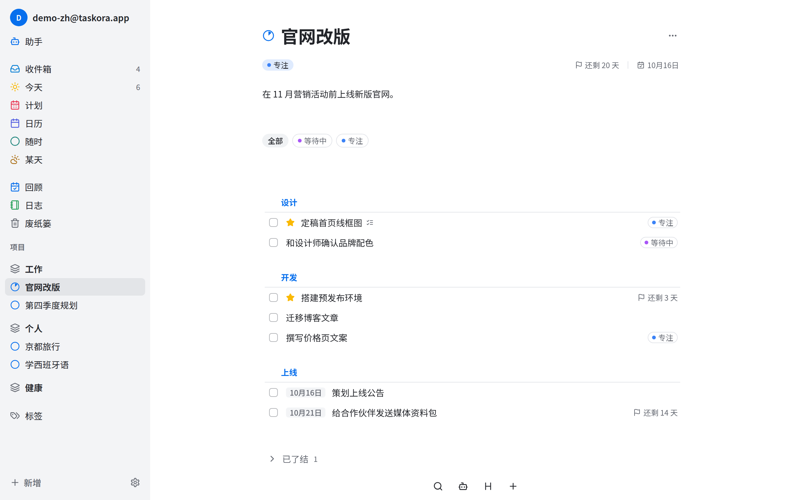
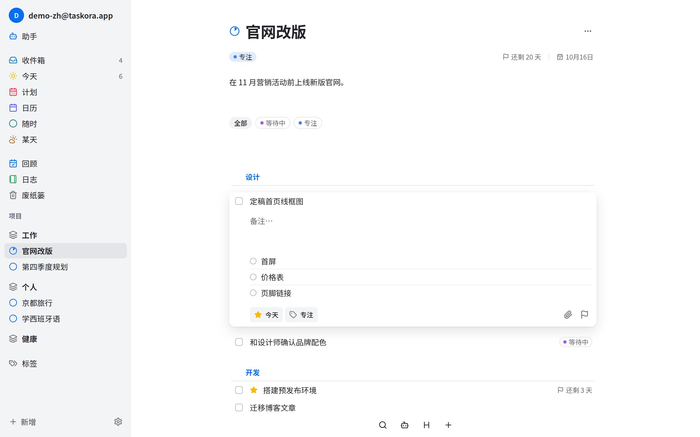
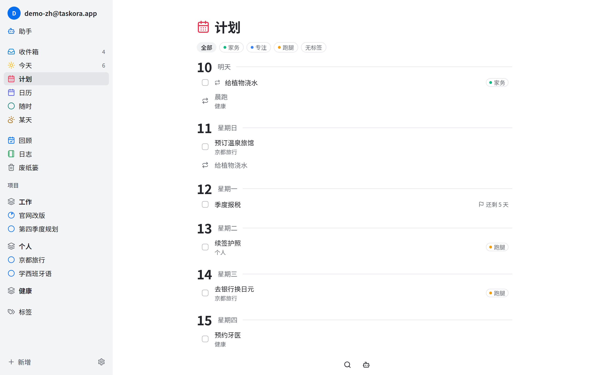
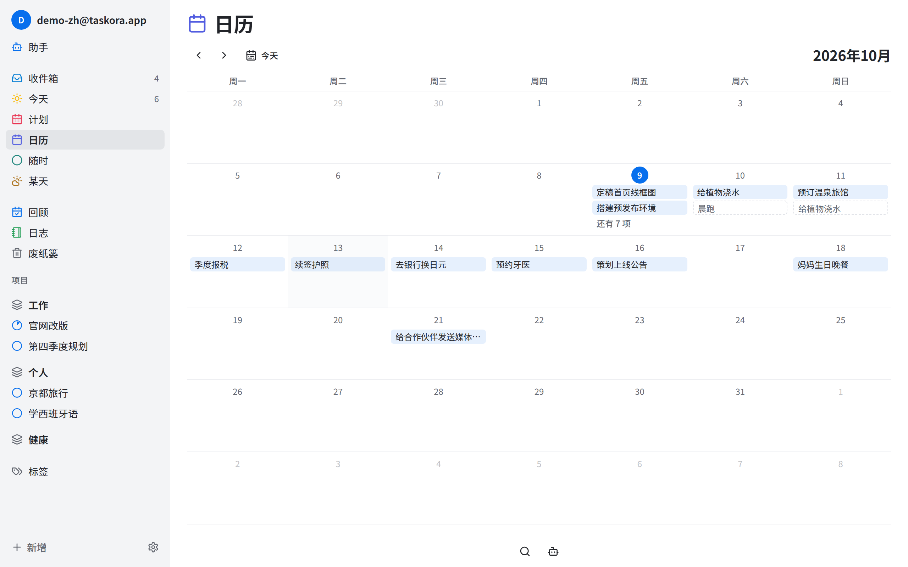
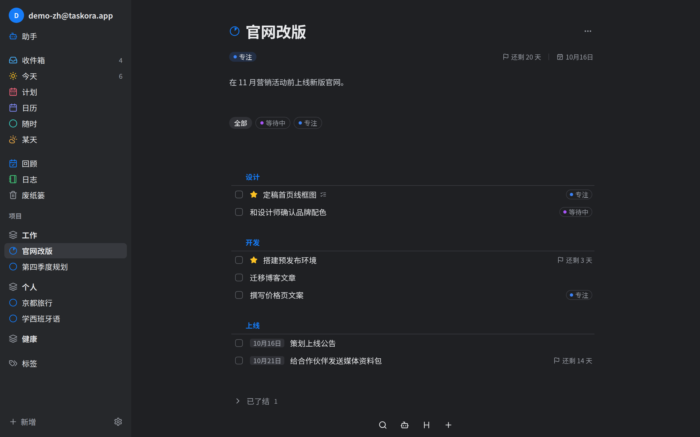

<div align="center">


# Taskora

**安静、顺手、可以自己部署的任务管理器。**

灵感来自 Things 3。支持网页、macOS、Windows、Linux 和 Android，所有设备通过你自己的服务器保持同步。

[下载](https://github.com/MaplumeX/Taskora/releases/latest) · [部署服务器](#部署服务器) · [快捷键](docs/keyboard-shortcuts.md) · [English](README.md)

</div>



## 为什么选 Taskora

- **只看今天要做的事。** 「今天」里只有你挑出来的任务，按项目和区域分好组；其余的安静地待在「随时」「计划」「某天」里，到时候再出现。
- **离线也能用。** 每台设备都保存一份完整的本地数据，断网时照常添加、修改、完成任务，恢复联网后自动同步。
- **数据在你自己手里。** 一条 `docker compose up` 就能跑起私有同步服务器，不依赖任何第三方云服务。
- **键盘优先。** 浏览、新建、完成、打标签、改日期都不用碰鼠标，所有快捷键都可以自定义。

## 截图

<table>
  <tr>
    <td width="50%"><br /><sub><b>项目</b>：用分组标题划分阶段，截止日期一目了然</sub></td>
    <td width="50%"><br /><sub><b>任务</b>：备注、检查清单、标签、日期、附件都在原地编辑</sub></td>
  </tr>
  <tr>
    <td width="50%"><br /><sub><b>计划</b>：按天排开接下来要做的事</sub></td>
    <td width="50%"><br /><sub><b>日历</b>：整月安排一眼看清</sub></td>
  </tr>
  <tr>
    <td colspan="2"><br /><sub><b>深色模式</b>：跟随系统，也可以手动切换</sub></td>
  </tr>
</table>

## 功能

### 整理

- **区域、项目、任务。** 区域是生活中的几大块（工作、个人、健康）；项目是区域里有终点的目标；任务是具体的一步。
- **分组标题**把长项目拆成几个阶段。
- **检查清单**把一个任务拆成小步骤，不必升级成项目。
- **标签**支持颜色和多层嵌套。按标签筛选时会连同子标签一起匹配，任务也会继承所属项目和区域的标签。
- **附件**：把文件拖到任务上即可添加，图片可以直接预览。
- **复制**（⌘D）任意任务或项目，拿来当模板用。

### 计划

- **收件箱**收下所有还没整理的想法。
- **今天**、**计划**、**随时**、**某天**按你打算什么时候做来展示任务。计划日期过了的任务会留在「今天」，不会堆成一片「逾期」。
- **截止日期**和计划日期分开设置，带倒计时，到期变红。
- **日历**展示整月安排。
- **重复任务和重复项目**：每天、每周指定星期几、每月、每年。可以从计划日期算下一次，也可以从完成那天算；需要时可以单独跳过一次。
- **提醒**在桌面端和 Android 上以系统通知弹出，通知里可以直接完成或稍后提醒。
- **回顾**按你为每个项目、区域设定的周期，逐个带你过一遍，避免计划过时。
- **日志**记录所有完成的事；**废纸篓**保存删除的内容，直到你清空它。

### 更高效

- **快速添加**：在桌面任意位置按 ⌘⇧Space / Ctrl+Shift+Space 记下任务，Taskora 缩在托盘里也行。
- **多选与拖放**：一次把多个任务拖进项目、分组标题，或拖到「计划」里的某一天。
- **搜索**区域、项目和任务，可以用标签缩小范围。
- **助手**（可选）：用对话的方式新建、整理、查找任务。使用你自己的 API Key，支持任何 OpenAI 兼容接口，Key 加密保存在你的服务器上。
- **简体中文和英文**界面。

## 下载客户端

从 [**GitHub Releases**](https://github.com/MaplumeX/Taskora/releases/latest) 下载最新版本。

| 平台 | 文件 |
|---|---|
| macOS（Apple 芯片） | `Taskora_x.y.z_aarch64.dmg` |
| Windows（x64） | `Taskora_x.y.z_x64-setup.exe` |
| Linux（x64） | `Taskora_x.y.z_amd64.AppImage` |
| Android（arm64） | `Taskora-vx.y.z.apk` |
| 网页版 | 随服务器一起提供，用任意现代浏览器打开即可 |

桌面端和 Android 首次启动时会要求填写**服务器地址**：你的 Taskora 服务器网址加上 `/api/v1`，例如 `https://tasks.example.com/api/v1`。

> [!NOTE]
> 客户端暂未做代码签名，首次打开时系统会给出警告：
>
> - **macOS**：在「应用程序」里右键 Taskora →「打开」→「打开」。如果提示应用已损坏，运行 `xattr -dr com.apple.quarantine /Applications/Taskora.app`。
> - **Windows**：在 SmartScreen 弹窗中点「更多信息」→「仍要运行」。
> - **Linux**：先 `chmod +x Taskora_*.AppImage`，再运行。
> - **Android**：允许浏览器或文件管理器安装未知来源应用。
>
> 目前还没有自动更新。升级时下载新版本覆盖安装即可，数据不会丢失。

## 部署服务器

服务器负责保存数据、同步各设备，并提供网页版。你需要一台装有 Docker 的机器。

**1. 获取配置文件**

```bash
mkdir taskora && cd taskora
curl -O https://raw.githubusercontent.com/MaplumeX/Taskora/main/docker-compose.yml
curl -o .env https://raw.githubusercontent.com/MaplumeX/Taskora/main/.env.example
```

**2. 编辑 `.env`**，至少改掉下面几项：

| 变量 | 说明 |
|---|---|
| `POSTGRES_PASSWORD` | 数据库密码 |
| `JWT_SECRET` | 用于签发登录会话，请填一串足够长的随机字符 |
| `AGENT_ENCRYPTION_KEY` | 用于加密助手的 API Key，用 `openssl rand -hex 32` 生成 |
| `NODE_ENV` | 改为 `production` |

**3. 启动**

```bash
docker compose up -d
```

打开 <http://localhost:7646> 注册账号。桌面端和 Android 的服务器地址填 `http://<你的服务器>:7646/api/v1`。

默认端口只绑定在 `127.0.0.1`。要从其他设备访问，请用反向代理（Caddy、nginx、Traefik 等）配好 HTTPS 并转发到 `7646` 端口。

**升级**

```bash
docker compose pull && docker compose up -d
```

想固定在某个版本，在 `.env` 里设置 `IMAGE_TAG`，例如 `IMAGE_TAG=v0.8.0`。

**备份**

数据存放在两个 Docker 卷里：`pgdata`（数据库）和 `blobs`（附件文件）。备份时两者要一起备份。

## 常见问题

**不部署服务器能用吗？**
不能。客户端可以离线使用，但登录和多设备同步都需要服务器。

**有 iPhone 版吗？**
暂时没有。在 iOS 上可以用 Safari 打开网页版。

**一定要配置助手吗？**
不需要。在「设置 → 助手」里填入 API Key 之前，它不会打扰你。

## 开发

Taskora 是一个 pnpm monorepo（React + Vite、NestJS + PostgreSQL、Tauri 2）。领域术语见 [`CONTEXT.md`](CONTEXT.md)，架构决策见 [`docs/adr/`](docs/adr/)，更新记录见 [`CHANGELOG.md`](CHANGELOG.md)。
